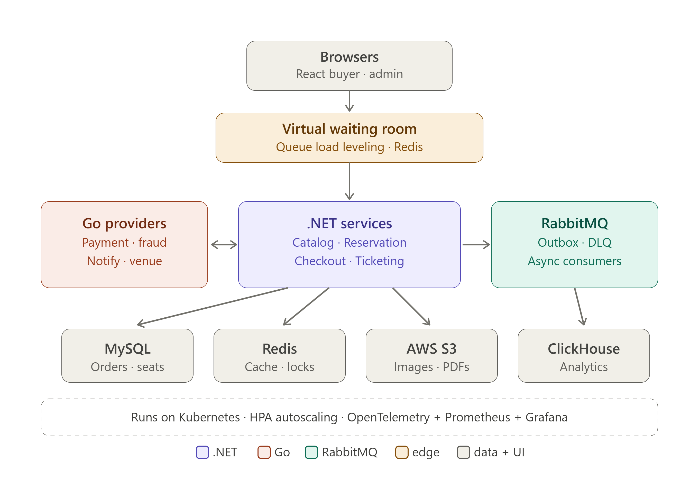

# Ticket Platform

An event-ticketing platform — browse events, pick seats, and check out — built to hold correct under extreme contention. The defining constraint is the **on-sale drop**: tens of thousands of buyers hitting the same few hundred seats the moment they're released, where the system must never sell the same seat twice and must stay up while doing it.

## What makes it hard

A ticket drop is a thundering herd against a tiny, fixed inventory. Two requirements pull against each other:

- **Correctness** — seat `A12` is sold at most once, no buyer is double-charged, and no paid order ever fails to issue a ticket.
- **Availability** — the system stays responsive while demand spikes 100–1000× for a few minutes, then drops back to idle.

Everything in the design exists to satisfy both at once.

## How it works

### Reserving a seat

Seats are held before they're paid for. A reservation is a row with a TTL; the seat row carries a version, and claiming it is a conditional update — if two buyers race for the same seat, exactly one wins and the other is told to pick again. Reservations that aren't checked out in time expire and return the seat to the pool. No distributed lock on the hot path; concurrency is resolved at the database with optimistic writes, which is cheap except during a drop.

### Surviving the drop

Most of the herd never reaches the checkout service. A **waiting room** sits in front: arriving buyers get a queue position in Redis, and the system admits a bounded number per second. The checkout path sees a steady, survivable stream instead of the full mob — load leveling, not a bigger box. Hot event and availability data are served from a Redis cache-aside layer with stampede protection so a cache miss during the spike doesn't collapse onto the database.

### Checking out

Checkout is a **saga**: reserve → fraud check → charge → issue ticket. Each external step can fail or time out, so each has a compensating action, and the whole flow is keyed by an idempotency token — a retried or duplicated checkout never double-charges. Calls to external providers are wrapped with timeouts, retries with jitter, and circuit breakers, because the providers are assumed to be unreliable (see below).

### Not losing events

State changes are published as domain events using the **outbox pattern**: the event is written in the same MySQL transaction as the state change, then relayed to RabbitMQ. A `payment succeeded` event can't be lost because the service crashed between the commit and the publish. Consumers are idempotent and dead-letter what they can't process, so retries and duplicate deliveries are safe.

### Reading and reporting

The transactional path (MySQL) and the analytical path are kept separate. Domain events stream into **ClickHouse**, which powers a real-time sales-and-funnel dashboard without putting analytical load on the system of record.

## Services

| Service               | Language | Responsibility                                                        |
| --------------------- | -------- | --------------------------------------------------------------------- |
| **Catalog**           | .NET     | Events, venues, sections, seats; availability reads                   |
| **Reservation**       | .NET     | Seat holds, TTL expiry, optimistic seat claims                        |
| **Checkout**          | .NET     | The checkout saga, idempotency, provider orchestration                |
| **Ticketing**         | .NET     | Issues tickets and e-ticket PDFs after successful payment             |
| **Payment provider**  | Go       | Fake payment gateway (failure injection, webhooks)                    |
| **Fraud provider**    | Go       | Fake fraud/identity check                                             |
| **Notification**      | Go       | Fake email/SMS delivery                                               |

.NET services use MediatR internally; resilience around provider calls uses Polly.

### The providers are deliberately hostile

The Go providers simulate the real world's unreliability. Each exposes configuration for injected latency, random `500`s, rate limiting, duplicate webhooks, and out-of-order webhook delivery. The .NET side is built to survive all of it — that's the whole reason they exist. They also model the *other* side of an integration: how to design an external API that behaves under stress.

## Infrastructure

| Component   | Role                                                                              |
| ----------- | --------------------------------------------------------------------------------- |
| MySQL       | Transactional system of record: orders, reservations, seat inventory              |
| Redis       | Hot-event cache, availability cache, waiting room, rate limiting                  |
| RabbitMQ    | Async events and commands between services, with dead-letter queues               |
| ClickHouse  | Analytics store for the sales/funnel dashboard                                     |
| AWS S3      | Seat-map images, event posters, generated e-ticket PDFs                           |
| Kubernetes  | Orchestration; HPA autoscales checkout/reservation during a drop                  |
| React       | Buyer seat-picker and admin dashboard; live availability over SSE/websockets      |

Observability is end-to-end: OpenTelemetry tracing across the .NET and Go services, Prometheus + Grafana metrics, and structured logs correlated by a single id, so one checkout can be followed across every hop.

## Architecture



## Tech stack

- **Core services:** .NET, MediatR, Polly
- **External providers:** Go
- **Datastores:** MySQL · Redis · ClickHouse
- **Messaging:** RabbitMQ
- **Frontend:** React (SSE/websockets)
- **Infrastructure:** Docker Compose (local), Kubernetes + HPA, AWS S3
- **Observability:** OpenTelemetry, Prometheus, Grafana
- **Load & chaos:** k6, fault injection

## Validating it under load

The system is meant to be proven, not assumed. **k6** scripts reproduce the on-sale spike to find the breaking point and tune autoscaling, the waiting room admission rate, and connection pools against real numbers. **Chaos experiments** then attack a healthy system — kill checkout pods mid-saga, blackhole the payment provider, inject network latency — and the bar is that it degrades gracefully and recovers without losing money or double-selling a seat.

## Project status

Early. The build proceeds as thin vertical slices that each touch the whole stack, in this order:

1. Walking skeleton — create an event, list it, render it in React, with the local stack in Docker Compose.
2. Catalog and the seat-oversell problem (optimistic concurrency + reservation TTLs).
3. Go providers with failure injection.
4. Checkout saga, idempotency, and provider resilience.
5. Reliable messaging — outbox, RabbitMQ topology, idempotent consumers, DLQs.
6. Caching and the waiting room.
7. Analytics pipeline into ClickHouse.
8. React seat-picker and admin with live availability.
9. Kubernetes, autoscaling, and S3 assets.
10. End-to-end observability.
11. Load testing.
12. Chaos engineering.

## Getting started

The local environment runs on Docker Compose (MySQL, Redis, RabbitMQ, ClickHouse). Setup instructions land with the walking skeleton (step 1).

```bash
# coming with the walking skeleton
docker compose up -d
```
